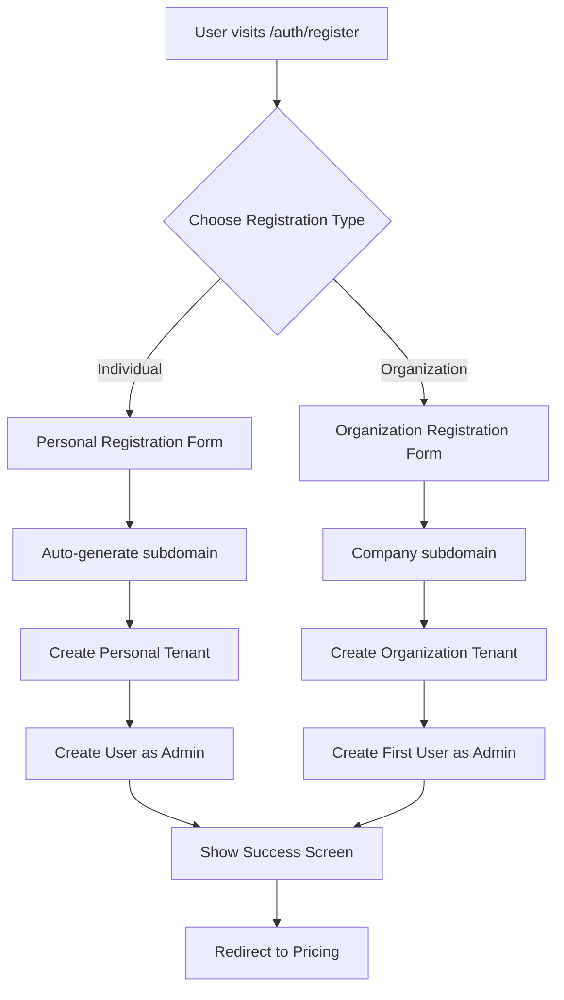

# 🚀 Individual User Registration Architecture

## 📋 Overview

Yes, Archivus can absolutely support individual user registration with the current backend structure! Here's how we've implemented it while maintaining the multi-tenant architecture.

## 🏗️ Database Architecture

The current database structure requires:
- Every user must belong to a tenant (`users.tenant_id NOT NULL`)
- Every tenant must have a unique subdomain (`tenants.subdomain UNIQUE`)
- All resources are tenant-scoped for data isolation

## 💡 Solution: Personal Workspaces

We create a **personal tenant** for each individual user, effectively giving them their own isolated workspace.

### Registration Flow



## 🔧 Implementation Details

### 1. **Registration Type Selection**
```typescript
// User chooses between:
- Personal Use (Individual)
- Team/Business (Organization)
```

### 2. **Individual Registration**
```typescript
// For individuals:
{
  email: "john@example.com",
  first_name: "John",
  last_name: "Doe",
  company: "John Doe's Workspace", // Auto-generated
  registration_type: "individual"
}

// Subdomain: "john-doe-a7x9k" (name + random suffix)
```

### 3. **Backend Handling**
The backend would need to:
```typescript
// When registration_type === 'individual':
1. Create tenant:
   - name: "John Doe's Workspace"
   - subdomain: "john-doe-a7x9k"
   - subscription_tier: "starter" or "free"
   
2. Create user:
   - tenant_id: newly_created_tenant.id
   - role: "admin"
   - All other user fields
```

## 🎯 Benefits of This Approach

### For Individual Users:
- ✅ Complete data isolation and privacy
- ✅ Own subdomain (can be customized later)
- ✅ Full admin control of their workspace
- ✅ Can invite others later (upgrade to team)
- ✅ Clean upgrade path to organization

### For the Platform:
- ✅ No database schema changes needed
- ✅ Consistent multi-tenant architecture
- ✅ Same security model for all users
- ✅ Easy to implement quotas/limits
- ✅ Clear monetization path

## 📊 Subscription Considerations

### Free Tier for Individuals
```typescript
// Suggested limits:
{
  documents: 100,
  storage: 1GB,
  ai_credits: 50/month,
  users: 1
}
```

### Upgrade Paths
1. **Storage Upgrade**: More documents/storage
2. **AI Upgrade**: More AI credits
3. **Team Upgrade**: Convert to organization, invite members

## 🔐 Login Experience

### Simplified Login for Individuals
```typescript
// Option 1: Remember subdomain
localStorage.setItem('last_subdomain', subdomain)

// Option 2: Email-based lookup
// Backend endpoint: POST /api/v1/auth/lookup-subdomain
// Input: { email: "john@example.com" }
// Output: { subdomain: "john-doe-a7x9k" }
```

## 📱 UI/UX Improvements

### 1. **Registration Selection Screen**
- Clear distinction between personal/business use
- Highlight benefits of each option
- Show example use cases

### 2. **Subdomain Handling**
- Auto-generate for individuals
- Allow customization in settings
- Option to use email-based login

### 3. **Dashboard Customization**
- Personal dashboard for individuals
- Hide team-specific features
- Focus on personal productivity

## 🚀 Future Enhancements

### 1. **Social Features** (Optional)
- Public document sharing
- Document templates marketplace
- Community insights

### 2. **Migration Tools**
- Import from other services
- Bulk upload for initial setup
- Integration with personal cloud storage

### 3. **Personal AI Assistant**
- Personalized AI training
- Custom document categories
- Personal knowledge base

## 📝 Implementation Checklist

- [x] Create registration type selector
- [x] Update registration form for individuals
- [x] Auto-generate personal subdomains
- [x] Show subdomain in success screen
- [ ] Backend endpoint for individual registration
- [ ] Email-based subdomain lookup
- [ ] Personal dashboard customization
- [ ] Free tier implementation
- [ ] Upgrade flow to team account

## 🎉 Conclusion

With this architecture, Archivus can serve both **individual users** and **organizations** without any database schema changes. Each individual gets their own secure, isolated workspace while maintaining the flexibility to upgrade to a team account in the future.

This approach scales well and provides a clear path for monetization through storage, AI credits, and team features!